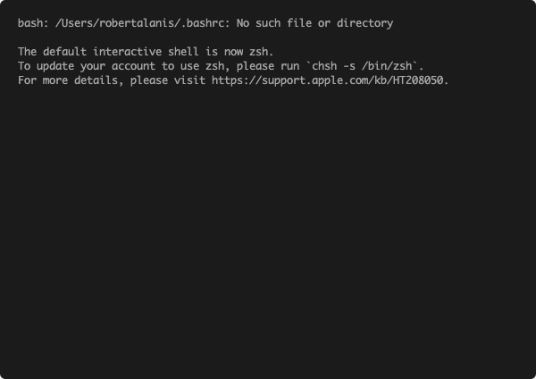

# Constructor Word Guess

This is Word Guess command-line game using constructor functions.

### Overview

This game makes use of three main files:

* **Letter.js**: Contains a constructor, Letter. This constructor will display an underlying character or a blank placeholder (such as an underscore), depending on whether or not the user has guessed the letter. 

  In order to accomplish this my constructor defines:

  * A string value to store the underlying character for the letter
  * A boolean value that stores whether that letter has been guessed yet
  * A function that returns the underlying character if the letter has been guessed, or a placeholder (underscore) if the letter has not been guessed
  * A function that takes a character as an argument and checks it against the underlying character, updating the stored boolean value to true if it was guessed correctly

* **Word.js**: Contains a constructor, Word that depends on the Letter constructor. This is used to create an object representing the current word the user is attempting to guess. 

In order to accomplish this my constructor defines:

  * A function that creates an array of `new` Letter objects representing the letters of the underlying word
  * A function that returns a string representing the word. This should call the function on each letter object (the first function defined in `Letter.js`) that displays the character or an underscore and concatenate those together.
  * A function that takes a character as an argument and calls the guess function on each letter object (the second function defined in `Letter.js`)

* **index.js**: The file containing the logic for the the actual game, which depends on `Word.js` and:

  * Randomly selects a word and uses the `Word` constructor to store it
  * Prompts the user for each guess and keeps track of the user's remaining guesses

### Demo

### Technologies Utilized

* NodeJS
* JavaScript

### NPM Packages

* [Inquirer](https://www.npmjs.com/package/inquirer)
* [CLI-Table3](https://www.npmjs.com/package/cli-table3)
* [Chalk](https://www.npmjs.com/package/chalk)
* [Clear](https://www.npmjs.com/package/clear)

### Deployment
1. Clone repo
1. Open your terminal and navigate to the folder that contains the file `index.js`
1. Run `npm install` to install the required dependencies
1. Run `node liri.js` and you should be able to play the game following the inquirer prompts

### Notes

This game was a lot of fun to make and there are a few ideas I have for building on to it:

* Even though the theme was Latin American countries I had to omit `Costa Rica`, `Dominican Republic`, and `El Salvador` becuase `Letter.js` only allows for words with out spaces.
* I am not validating user input, so a user can enter characters that are not part of the alphabet, empty strings, or more than one character.
* I would like to display the characters that have already been guessed and validate against entering those again.
* Finally, I would like to provide a fun fact about the country after each round ends.
